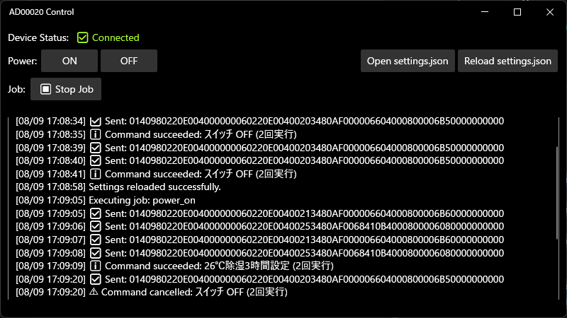

AD00020: https://github.com/bit-trade-one/AD00020-USB_IR_Remote_Controller

x86 向けにビルドする (x_86-64 (64-bit) は不可)



デフォルトの `settings/settings.json{

```json
{
  "power_on": {
    "bytes": [
      "0140980220E004000000060220E00400213480AF000006604000800006B60000000000",
      "0140980220E004000000060220E00400253480AF0068410B4000800006080000000000",
      "0140980220E004000000060220E00400213480AF000006604000800006B60000000000",
      "0140980220E004000000060220E00400253480AF0068410B4000800006080000000000"
    ],
    "comment": "除湿 26℃ 3 時間設定 (2 回実行)"
  },
  "power_off": {
    "bytes": [
      "0140980220E004000000060220E00400203480AF000006604000800006B50000000000",
      "0140980220E004000000060220E00400203480AF000006604000800006B50000000000"
    ],
    "comment": "スイッチ OFF (2 回実行)"
  },
  "job": [
    {
      "hour": 12,
      "command": "power_on"
    },
    {
      "hour": 13,
      "command": "power_off"
    },
    {
      "hour": 15,
      "command": "power_on"
    },
    {
      "hour": 16,
      "command": "power_off"
    },
    {
      "hour": 18,
      "command": "power_on"
    },
    {
      "hour": 19,
      "command": "power_off"
    }
  ],
  "dry26": {
    "bytes": [
      "0140980220E004000000060220E00400213480AF000006604000800006B60000000000"
    ],
    "comment": "除湿 26℃"
  },
  "dry26_5": {
    "bytes": [
      "0140980220E004000000060220E00400213480AF000006604080800006360000000000"
    ],
    "comment": "除湿 26.5℃"
  },
  "dry27": {
    "bytes": [
      "0140980220E004000000060220E00400213680AF000006604000800006B80000000000"
    ],
    "comment": "除湿 27℃"
  },
  "dry27_5": {
    "bytes": [
      "0140980220E004000000060220E00400213680AF000006604080800006380000000000"
    ],
    "comment": "除湿 27.5℃"
  },
  "dry28": {
    "bytes": [
      "0140980220E004000000060220E00400213880AF000006604000800006BA0000000000"
    ],
    "comment": "除湿 28℃"
  }
}
```
